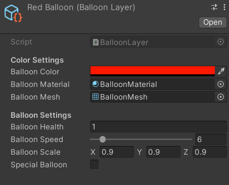

# BO-TowerDefense

## My tower defense project
In this project we need to make a tower defense game. My game was inspired on the famous tower defense Bloons TD 6. This project needed to be done in 7 weeks (19 sep - 11 nov). 

## Mechanics
The basic mechanics are simple. You have your map where **you can place your towers**. There is a path in the map where the balloons will float on. **They follow a waypoint path to the end of the map**. If the **balloon is in the range** of the tower he will **attack the balloon**. If the **balloon dies you wil get gold** to **buy new towers or upgrades**.

### Balloon layer Mechanics
One of the mechanics where I put alot of time in is the balloon layers. I wanted to have the same system that bloons TD 6 have. For example if the balloon is blue and the tower hit him, the layer will change to red. If he changes his layer he will change his speed, scale and lives.

First I tried to use prefabs to execute this mechanic. I made different prefabs for each layer of a balloon, But because I use an object pool (I spawned 50 balloons in from 1 prefab) I could not use multiple prefabs. After a while I got good advice to use scriptable objects for this mechanic. In the scriptable object you can store data of 1 layer for the balloons. 



When the wave start a function will be called to send a balloon layer to the balloon that is going to be activated. When the balloon receives the layer, it will take the layer values and apply it to his own values. If the balloon is set up correctly, it will be activated. 

I use an dictionary to track what layer is next if the balloon take damage. If the balloon take damage the dictionary will look at the health of the balloon. 

## What I learned
- To plan a 7 week project all by myself
- To work better with UI in Unity
- How to work with scriptable objects
- How a object pool works and how i can use it in my game.
- I now know how I can make system that is easy to use and easy to change. 

## Tower Defense Mechanic flowchart
```mermaid
flowchart TD

start((start))-->|In Awake|populatePool
populatePool-->setDeactive(Set all balloons on disabled)
setDeactive-->waveStart{Wait for the wave to start}
waveStart-->nextWave(Next wave started)
nextWave-->inPool(is a balloon not active in the pool)
inPool-->isNotEnabled(Yes)
isNotEnabled-->|Take the balloon information|balloonSetActive(Set the balloon active)
balloonSetActive-->move(Go to the finish)
move-->balloonHit(If the balloon get hit)
balloonHit-->destroyLayer(Change the layer of the balloon)
destroyLayer-->|If there are no more layers|disableBalloon
disableBalloon-->waveStart
waveStart-->|Completed all waves|youWin((You won the game))

